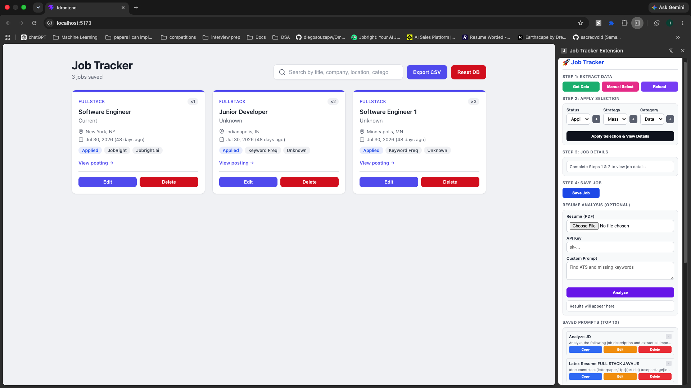
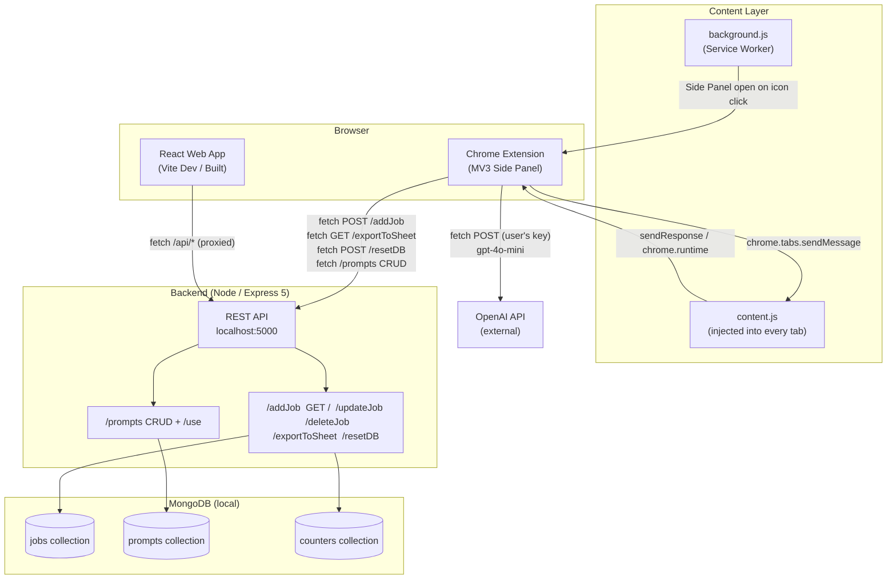
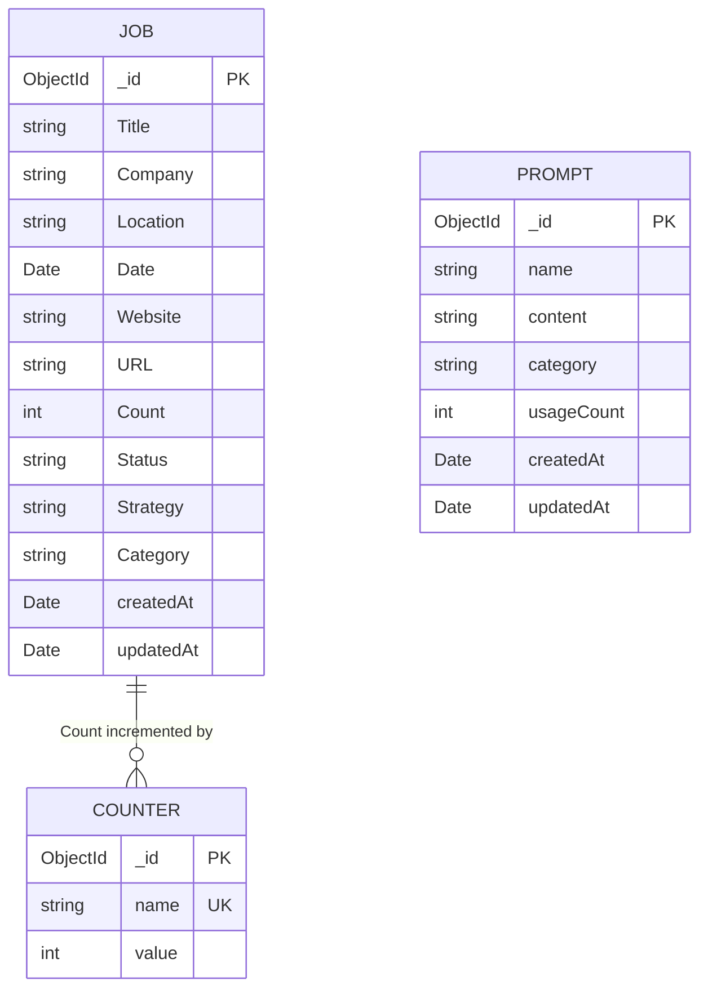
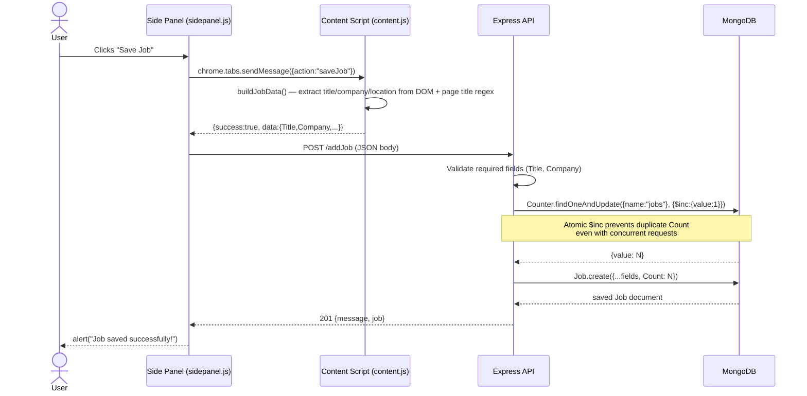
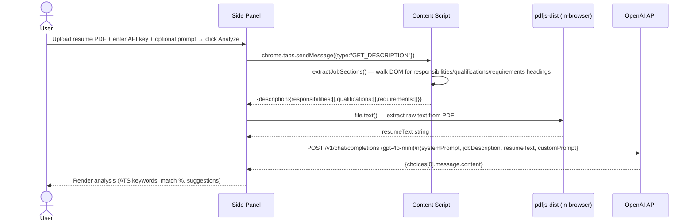
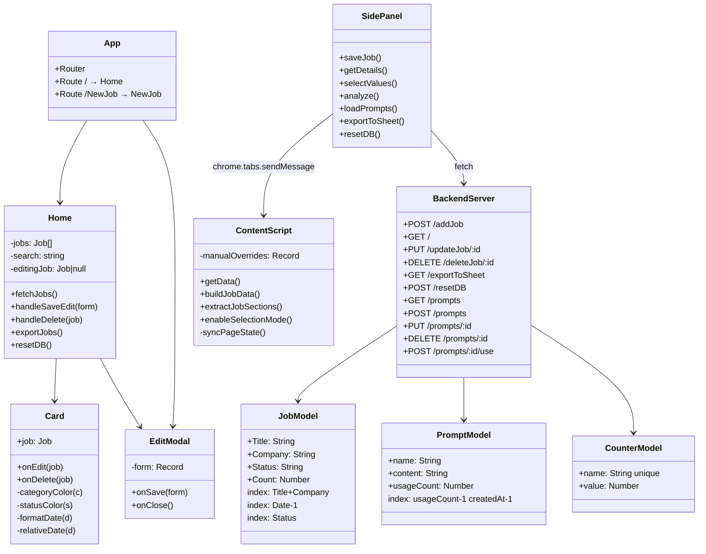
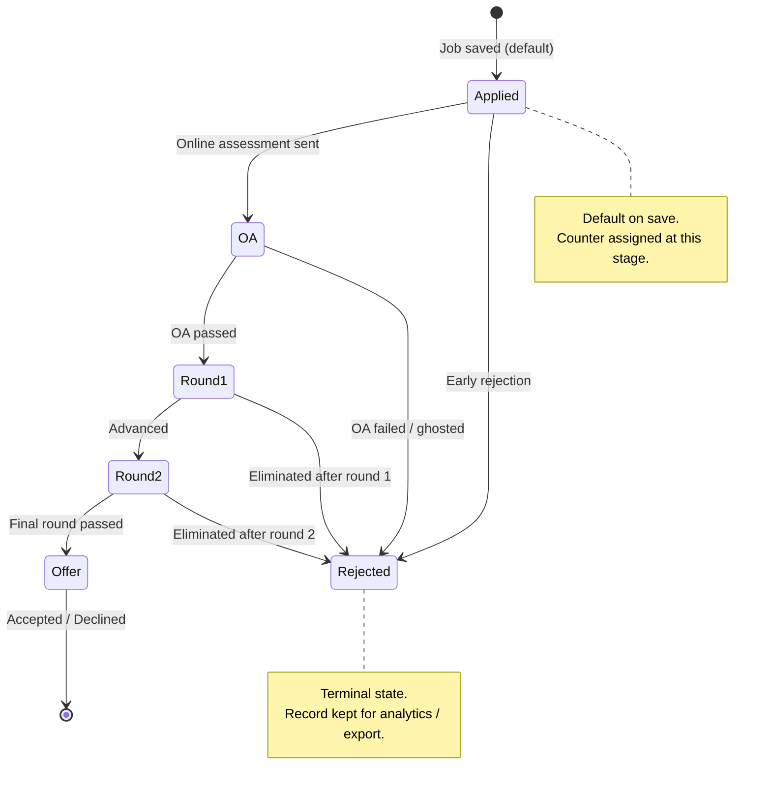

# Job Tracker



## Project Overview

A full-stack job application tracker built for active job seekers who apply to large volumes of roles across multiple platforms. It solves the friction of manually logging applications by pairing a **Chrome extension** (that auto-extracts job data from any job board) with a **web dashboard** (for filtering, editing, exporting, and tracking application status). A shared REST API and MongoDB backend keeps both surfaces in sync, including a monotonic application counter that stays consistent regardless of which client saves a job.

---

## Tech Stack

| Layer | Technology | Why |
|---|---|---|
| Frontend | React 19 + Vite 8 | Latest concurrent React with fast HMR; no CRA overhead |
| Frontend routing | React Router v7 | Lightweight SPA routing with file-based page structure |
| Styling | Tailwind CSS (utility classes inline) + custom CSS | Utility classes for rapid layout; custom CSS for design tokens (card strips, badges, modals) |
| Linting | oxlint | Rust-based linter; orders of magnitude faster than ESLint at scale |
| Extension | Chrome MV3 (Manifest v3) | Required for any new Chrome extension submission; Service Worker background script |
| Extension side panel | Chrome Side Panel API | Persistent overlay that doesn't interrupt browsing, no popup dismissal UX friction |
| Extension AI feature | OpenAI `gpt-4o-mini` API (user-supplied key) | Cheapest capable model for ATS resume analysis; key stays client-side, never touches our backend |
| Extension PDF parsing | pdfjs-dist | Client-side PDF text extraction, no file upload needed |
| Backend | Node.js + Express 5 | Familiar JS stack, async-native; Express 5 ships built-in async error propagation |
| Database | MongoDB 7 + Mongoose 9 | Schema-flexible for evolving job fields; Mongoose validators enforce invariants at the model layer |
| Counter pattern | MongoDB `findOneAndUpdate` + `$inc` | Atomic, race-condition-safe application counter across concurrent clients |
| Dev proxy | Vite `server.proxy` | Forwards `/api/*` to `localhost:5000` in dev; eliminates CORS complexity |

---

## Architecture Overview



---

## Data Model



> **Note:** There is no auth/user model — this is a single-user local tool. `Counter` holds one document (`name: "jobs"`) that acts as the canonical application sequence number across all clients.

---

## Key Workflows

### 1. Saving a Job from the Extension

This flow shows the multi-step message-passing chain through Chrome's extension runtime and the atomic counter write.



### 2. ATS Resume Analysis (Extension AI Feature)

This flow is entirely client-side and calls OpenAI directly — the backend is never involved.



---

## Module Structure



---

## State / Lifecycle Logic

Application status follows a real-world hiring funnel. The valid transitions below were inferred from the hardcoded `Status` options in the extension side panel and the `STATUS_COLORS` map in `Card.jsx`.



> Custom statuses can be added at runtime via the "+" button in the side panel (persisted to `chrome.storage.local`). These flow into the same funnel at whatever stage the user assigns them.

---

## Key Tradeoff Decision

### Where to own the application counter: backend vs. client

The extension originally tracked `applicationCounter` in `chrome.storage.local`. When the web frontend was added as a second write surface, client-side counters would diverge. The decision was to move the counter entirely to the backend using MongoDB's atomic `$inc` operator.

```mermaid
quadrantChart
    title Counter Strategy — Consistency vs. Implementation Complexity
    x-axis Low Complexity --> High Complexity
    y-axis Low Consistency --> High Consistency

    quadrant-1 Ideal
    quadrant-2 Over-engineered
    quadrant-3 Risky
    quadrant-4 Simple but fragile

    chrome.storage.local only: [0.1, 0.2]
    Max(Job.Count) on each write: [0.3, 0.5]
    Redis atomic INCR: [0.85, 0.95]
    MongoDB $inc on Counter doc: [0.55, 0.9]
```

**Chosen approach:** `MongoDB $inc on Counter doc` — atomic at the DB level, no extra infrastructure, handles the race condition documented in `getNextCount()` with a duplicate-key catch that falls back to a second `findOneAndUpdate`.

---

## Notable Engineering Decisions

- **Race-condition-safe counter bootstrap.** On first use, `getNextCount()` seeds the counter from `MAX(Job.Count)` so existing records aren't re-numbered. A `try/catch` on `11000` (duplicate key) handles the edge case where two requests initialize the counter simultaneously.

- **Regex-based title/company extraction from page titles.** Rather than site-specific scrapers (which break on DOM changes), `content.js` parses tab titles using patterns like `"Role @ Company | Site"` and `"Role at Company"`. This works across LinkedIn, Jobright, and most job boards without maintenance.

- **Manual DOM selection as a fallback.** When auto-extraction yields `"Unknown"` fields, the extension enters a step-through selection mode — changing the cursor to crosshair and attaching a capture-phase `click` listener — so the user can point at any element. Overrides are page-scoped and cleared on URL change via `syncPageState()`.

- **CSV export in two places, differently.** The extension calls `GET /exportToSheet` (server generates CSV with UTF-8 BOM). The web frontend generates the CSV client-side using `Blob` + `URL.createObjectURL`. Both add the BOM (`\uFEFF`) so Excel renders special characters correctly. Server-side export is in the extension because it doesn't have DOM blob APIs; client-side is in the frontend to avoid an unnecessary round-trip.

- **Content Security Policy compliance for prompt buttons.** Chrome MV3 blocks `onclick` inline handlers in extension pages. The prompts list uses delegated event listening (`promptsList.addEventListener("click", ...)`) with `data-action` / `data-id` attributes on buttons, fully compatible with MV3's strict CSP.

- **`useMemo` for client-side search filtering.** `Home.jsx` filters jobs with `useMemo` keyed on `[jobs, search]`. This avoids re-filtering the full array on every unrelated re-render and keeps search snappy even with hundreds of cards.

---

## Setup & Run Instructions

### Prerequisites
- Node.js ≥ 18
- MongoDB running locally on `mongodb://127.0.0.1:27017`

### Backend

```bash
cd backend
npm install
node server.js
# API available at http://localhost:5000
```

### Web Frontend

```bash
cd frontend
npm install
npm run dev
# Dev server at http://localhost:5173 (proxies /api/* → localhost:5000)
```

### Chrome Extension

1. Open `chrome://extensions`
2. Enable **Developer mode**
3. Click **Load unpacked** → select the `JobExtension/` folder
4. Pin the extension; click the icon to open the Side Panel

> The extension calls `http://localhost:5000` directly (no proxy). The backend CORS config explicitly allows `chrome-extension://*` origins.

---

